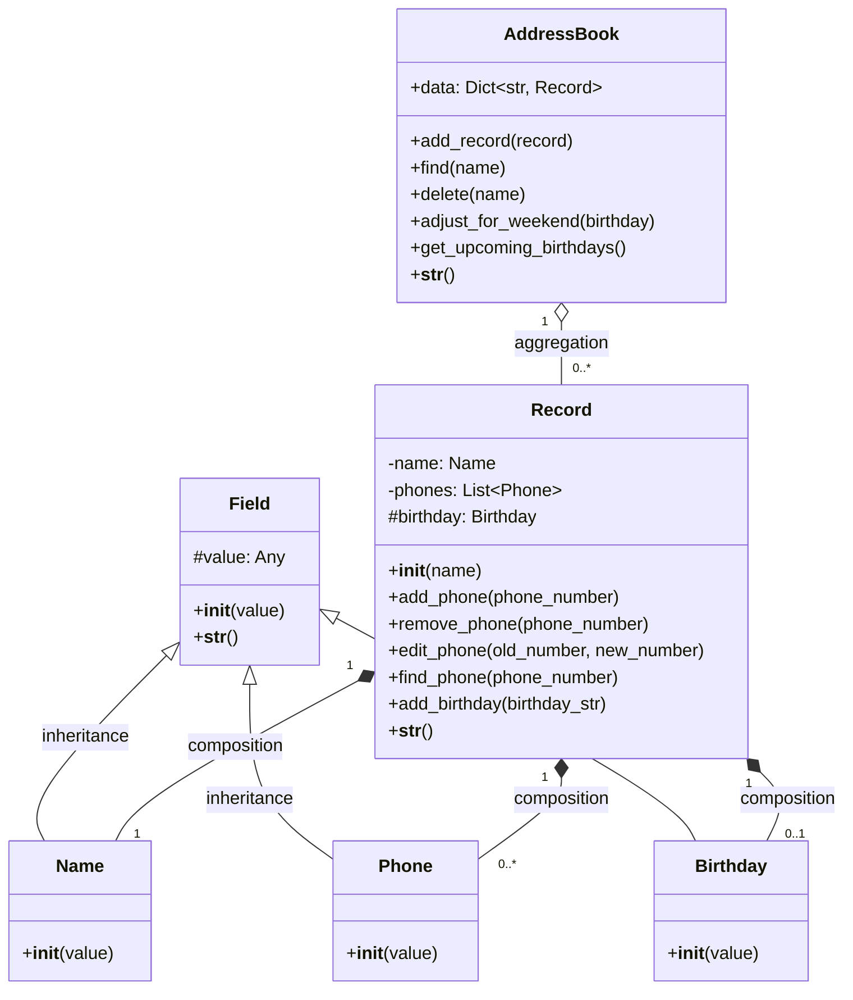

# 📒 Contact Book (Address Book) — Console Assistant Bot

A simple command-line contact book assistant bot written in Python 3.13, using object-oriented programming principles.

This console bot helps you manage contacts: add, edit, delete, and search for phone numbers. Contacts can have multiple phone numbers, and each phone number is validated (must be exactly 10 digits). Additionally, contacts can store a birthday date, which is validated and used to track upcoming birthdays and send timely greetings.

This address book is automatically saved to disk when you exit the program and restored when you start it again, so you never lose your contacts!

---

## 💾 Data Persistence

- All your contacts and their data are automatically saved to a file (addressbook.pkl) when you exit the program.

- When you start the program again, your address book is restored from disk — you never lose your data between sessions.

- This is implemented using Python's pickle serialization protocol.

---

## 🧠 Features

- Interactive console assistant bot interface
- Add and remove contact records
- Edit and find phone numbers
- Support multiple phone numbers per contact
- Validate phone numbers (only 10-digit numeric values)
- Store and validate birthdays in format DD.MM.YYYY
- Retrieve contacts with birthdays in the next 7 days, including adjusted greeting dates if birthdays fall on weekends
- Pretty string representation of records and address book
- Automatic saving and loading (persistence) of your address book using pickle serialization

---

## 📦 Example Commands

```bash
add John 1234567890
add-birthday John 01.01.2000
phone John
show-birthday John
all
birthdays
exit
```

---

## 🛠 Technologies

- Python 3.13
- OOP principles
- Standard library (collections.UserDict, pickle)
- pickle for data serialization and persistence

---

## 🚀 Quick Start

### 📦 Installation

1.  **Clone the repository:**
    ```bash
    git clone git@github.com:Natalia-Kalashnikova/Assistant-Bot
    cd Assistant-Bot
    ```
2.  **Install dependencies using Poetry:**
    ```bash
    poetry install
    ```

### 🏃 Usage

To run the console assistant bot:
```bash
poetry run python contact_book/main.py
```

---

## UML Class Diagram

This is a UML class diagram. It illustrates the structure of classes, their attributes, and methods of interconnection.

